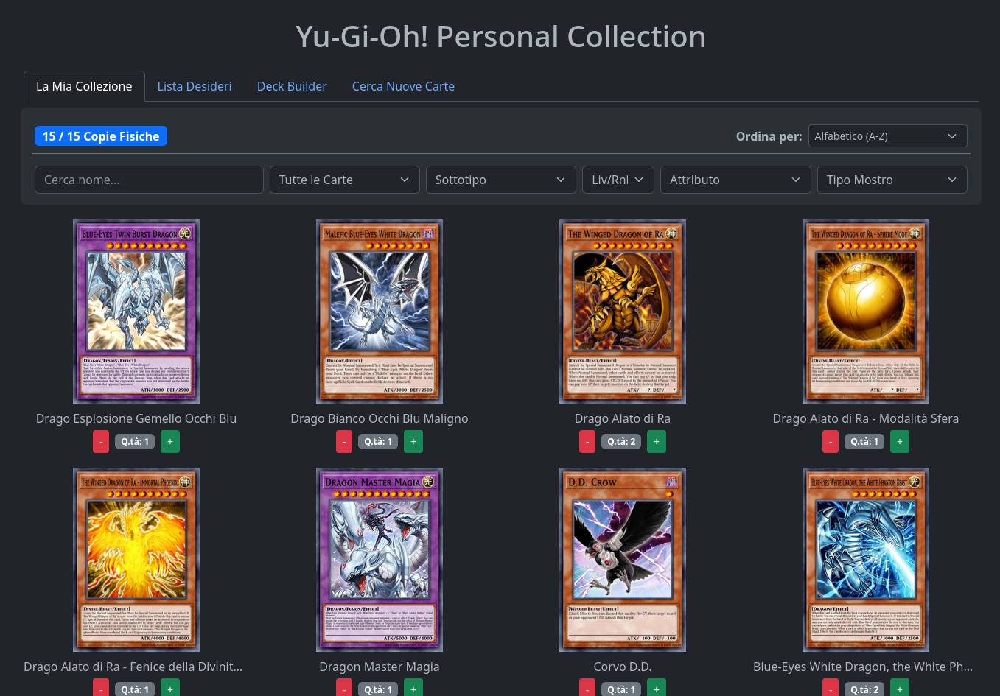
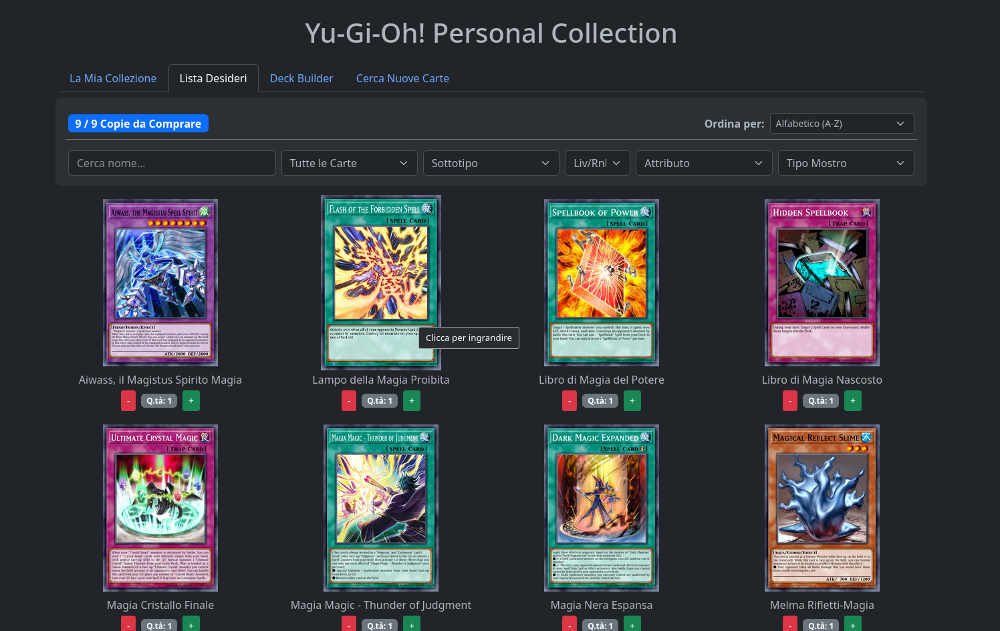
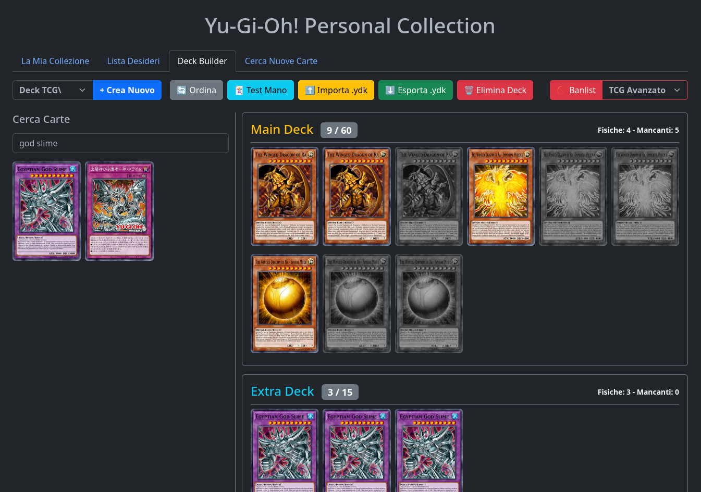
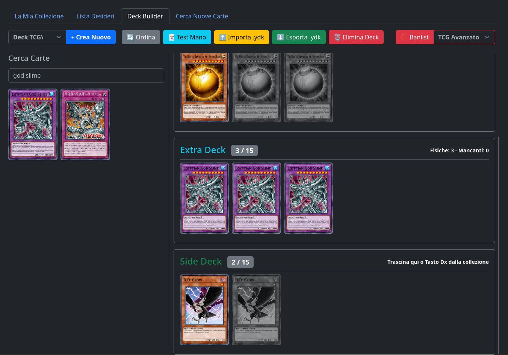
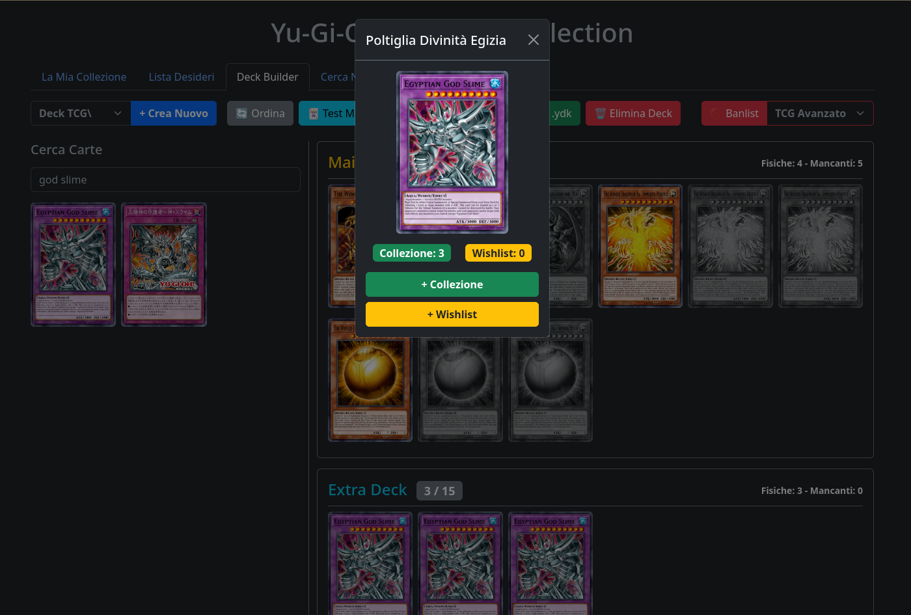
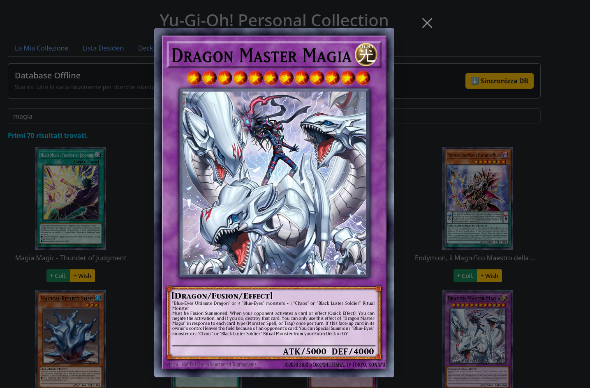

# 🎴 Yu-Gi-Oh! Personal Collection

Un'applicazione web completa, leggera e self-hosted per gestire la tua collezione di carte di Yu-Gi-Oh!, costruire mazzi competitivi e testare le tue strategie. 

Sviluppata per funzionare 24/7 su pc o server locali (come Raspberry Pi) tramite Docker, l'app offre un ambiente completamente autonomo con dati sempre aggiornati grazie all'integrazione con l'API ufficiale di YGOPRODeck.

---

## 📑 Indice
- [📸 Anteprima dell'Applicazione](#anteprima)
- [✨ Caratteristiche Principali](#caratteristiche)
- [🚀 Come Installare e Avviare l'App](#installazione)
  - [Metodo 1: File Eseguibili Standalone (Windows .exe / Linux) - Il più facile!](#metodo-1-file-eseguibili-standalone-windows-exe--linux---il-più-facile)
  - [Metodo 2: Installazione Standard (Python 3)](#metodo-2-installazione-standard-python-3)
  - [Metodo 3: Installazione per Server 24/7 (Docker Compose) - Consigliato sui server!](#metodo-3-installazione-per-server-247-docker-compose---consigliato-sui-server)
- [📂 Come usare le Banlist Personalizzate (.conf)](#banlist)
- [📡 Dati e Riconoscimenti](#dati)

---

<a id="anteprima"></a>
## 📸 Anteprima dell'Applicazione

<p align="center">
  
</p>
<br>
<p align="center">
  
</p>
<br>
<p align="center">
  
</p>
<br>
<p align="center">
  
</p>
<br>
<p align="center">
  
</p>
<br>
<p align="center">
  
</p>


---

<a id="caratteristiche"></a>
## ✨ Caratteristiche Principali

* 📦 **Gestione Collezione e Wishlist:** Tieni traccia delle carte che possiedi fisicamente e di quelle che stai cercando. Nel Deck Builder, le carte che hai inserito ma che ti mancano fisicamente verranno mostrate "ingrigite", permettendoti di capire a colpo d'occhio cosa ti manca per completare il mazzo.
* 🔄 **Sincronizzazione in Tempo Reale:** Scarica l'intero database mondiale delle carte (con nomi, effetti, attributi e immagini) con un solo click. Include il supporto per le carte in lingua italiana (se disponibili) e usa l'inglese come ripiego automatico per le ultimissime uscite.
* 🛠️ **Deck Builder Avanzato:** Costruisci i tuoi mazzi rispettando le regole ufficiali (limiti di 60 carte per il Main Deck, 15 per Extra e Side). Supporta il Drag & Drop e l'ordinamento automatico intelligente per tipologia di carta.
* 📜 **Formati e Banlist Storiche (Dynamic Engine):** 
  * Supporto nativo per i formati **TCG Avanzato** e **OCG**.
  * Motore storico integrato per **Goat Format (2005)** ed **Edison Format (2010)**: l'app calcola automaticamente la data di uscita originale della carta, bloccando in automatico le meccaniche o le carte uscite nel "futuro" senza bisogno di liste pre-compilate.
* ⚙️ **Banlist Personalizzate (File .conf):** Carica file `.lflist.conf` (gli stessi usati da simulatori come EDOPro o Dueling Nexus) direttamente nell'app o spostandoli nella cartella del server. L'app li riconoscerà automaticamente per applicare tornei con regole custom!
* 📤 **Import/Export YDK:** Compatibilità totale con i simulatori online. Esporta i tuoi mazzi in formato `.ydk` per giocarli su EDOPro/YGO Omega, o importa file YDK per analizzarli all'interno dell'app.
* 🃏 **Test della Mano Iniziale (Test Draw):** Simula pescate iniziali di 5 carte e testa la consistenza del mazzo in tempo reale, senza bisogno di tavoli fisici o simulatori esterni.

---

<a id="installazione"></a>
## 🚀 Come Installare e Avviare l'App

Puoi far girare l'applicazione in tre modi diversi, a seconda delle tue esigenze. Ricorda appena avvii l'applicazione di andare nella sezione **Cerca Nuove Carte** e clicca su **Sincronizza DB**, altrimenti le carte non saranno cercabili !!!

### Metodo 1: File Eseguibili Standalone (Windows .exe / Linux) - Il più facile!
Se non vuoi installare né Python né Docker, puoi usare i file eseguibili precompilati, perfetti per l'uso personale su PC.

1. Scarica il file eseguibile per il tuo sistema operativo **[QUI](https://github.com/MarcoRab01/Yu-Gi-Oh-Personal-Collection/releases/tag/yugioh-collection)** (es. il file `.exe` per Windows o il file binario PE per Linux).
2. Mettilo in una cartella apposita cosi quando verrà avviato si genereranno i file per il database e la cartella delle banlist.
3. Fai doppio clic sul file per avviarlo.
4. Il browser predefinito si aprirà automaticamente sull'applicazione!
5. **🛑 Come spegnerlo:** Quando hai finito di usare l'app, ti basterà chiudere la finestra del browser e questo spegnerà in modo sicuro e definitivo il processo in background sul tuo computer.

---

### Metodo 2: Installazione Standard (Python 3)
Ideale per chi vuole testare l'app al volo sul proprio computer.

1. **Assicurati di avere Python 3 installato** sul tuo sistema.
2. Clona o scarica questa repository sul tuo computer.
3. Apri il terminale nella cartella del progetto e installa i requisiti:
   ```bash
   pip install -r requirements.txt
   ```
4. Avvia l'applicazione:
   ```bash
   python3 app.py
   ```
   che avvierà in automatico il browser all'indirizzo: `http://localhost:5000`
5. **🛑 Come spegnerlo**: Torna nella finestra del terminale in cui l'applicazione sta girando e premi la combinazione di tasti CTRL+C sulla tastiera per arrestare il server.

---

### Metodo 3: Installazione per Server 24/7 (Docker Compose) - Consigliato sui server!
Se vuoi installare l'app su un Raspberry Pi, un server Linux o un NAS per renderla disponibile sulla tua rete Wi-Fi di casa ininterrottamente, usa Docker Compose. Il file `docker-compose.yml` è già configurato per salvare permanentemente i tuoi progressi.

1. Assicurati di avere **Docker** e **Docker Compose** installati.
2. Apri il terminale nella cartella del progetto ed esegui:
   ```bash
   docker compose up -d --build
   ```
3. Finito! L'app è ora in esecuzione in background. Puoi chiudere il terminale.
4. Per accedere, apri il browser e digita l'indirizzo IP del tuo server (es. `http://192.168.1.xxx:5000`) oppure direttamente sul tuo pc (`http://127.0.0.1:5000`)
5. **🛑 Come spegnerlo**: Se per qualsiasi motivo desideri spegnere il server e fermare l'applicazione, apri il terminale nella cartella del progetto ed esegui il comando:

   ```bash
   docker compose down
   ```
   Oppure da qualsiasi cartella

   ```bash
   docker compose down yugioh-personalcollection
   ```
*(Nota: Grazie al Docker Compose, se il server si riavvia per un calo di corrente, l'app si riaccenderà da sola automaticamente. I tuoi mazzi e le tue carte sono al sicuro nel file database generato in automatico e montato come volume).*

---

<a id="banlist"></a>
## 📂 Come usare le Banlist Personalizzate (.conf)

Vuoi giocare un formato specifico con i tuoi amici o creare una tua banlist personale? 
Nessun problema:

1. Crea o scarica un file banlist standard (es. `BanlistTorneo.conf`) da un qualsiasi sito (es. [YGOProg Banlist Builder](https://www.ygoprog.com/BanlistBuilder)).
2. Puoi inserirlo nella tua app in due modi:
   * **Dall'interfaccia:** Nel Deck Builder, apri la tendina delle Banlist e clicca su "➕ Carica nuovo .conf...".
   * **Direttamente dal server:** Trascina il file all'interno della cartella `banlist/` del progetto. L'applicazione lo rileverà istantaneamente.
3. L'app bloccherà o limiterà le carte esattamente come indicato nel tuo file, in modo da poter creare i deck con le tue carte direttamente con quella banlist! Puoi eliminare le banlist personalizzate non più necessarie cliccando sull'icona del cestino 🗑️ a fianco del menu.

---

<a id="dati"></a>
## 📡 Dati e Riconoscimenti

L'applicazione non contiene carte pre-caricate per mantenere il software leggerissimo. Al primo avvio, ti basterà recarti nella sezione "**Cerca Nuove Carte**" e cliccare su **"Sincronizza DB"** per scaricare i dati più recenti in tempo reale e poter cercare le carte molto piu velocemente.

I dati delle carte, le immagini e le legalità dei tornei ufficiali sono forniti generosamente dalle API pubbliche di **[YGOPRODeck](https://ygoprodeck.com/)**.